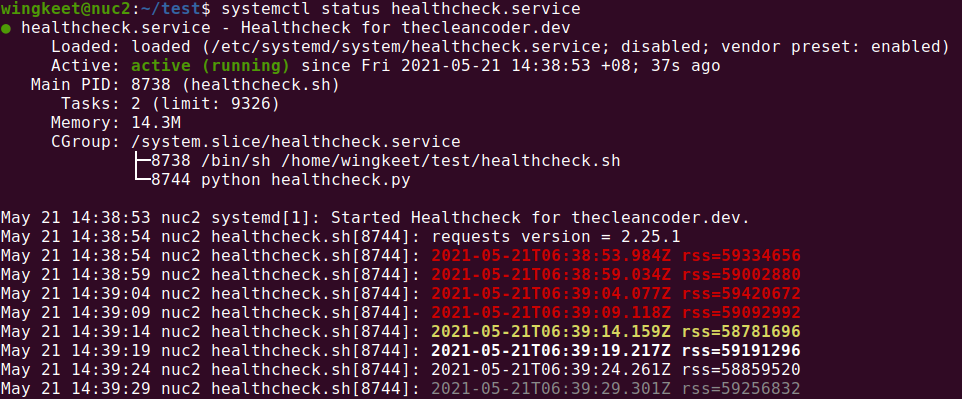

# healthcheck

### Installation
```
$ cd ~
$ git clone https://github.com/wingkeet/healthcheck.git
$ cd healthcheck
$ python3 -m venv venv
$ source venv/bin/activate
$ pip install requests
$ deactivate
$ sudo cp healthcheck.service /etc/systemd/system
$ sudo systemctl start healthcheck
$ journalctl -f -u healthcheck
$ sudo systemctl stop healthcheck
```



### References
- [Understanding Systemd Units and Unit Files](https://www.digitalocean.com/community/tutorials/understanding-systemd-units-and-unit-files)
- [How to create systemd service unit in Linux](https://linuxconfig.org/how-to-create-systemd-service-unit-in-linux)
- [systemd service unit configuration man page](https://www.freedesktop.org/software/systemd/man/systemd.service.html)
- [systemd/Journal](https://wiki.archlinux.org/title/Systemd/Journal)
- [Logging in New-Style Daemons with systemd](https://www.loggly.com/blog/logging-in-new-style-daemons-with-systemd/)
- [Python Logging Basics](https://www.loggly.com/ultimate-guide/python-logging-basics/)
- [New-style daemons in Python](https://www.loggly.com/blog/new-style-daemons-python/)
